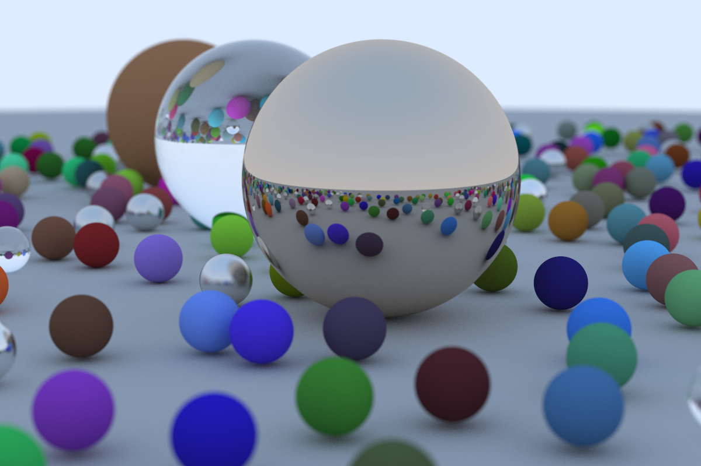

# Ray Tracing in One Weekend - Go Implementation

This code repository has the Go implementation of the ray tracer presented in the [_Ray Tracing in One Weekend Series_](https://raytracing.github.io/) series by Peter Shirley. I implemented this project in GoLang to get more familiar with the programming language. It was a fun long weekend project.

You can ran the code by invoking:
```
go run main.go > image.ppm
```

Below is the final shot render shot for the book [_Ray Tracing in One Weekend_](https://raytracing.github.io/books/RayTracingInOneWeekend.html):


